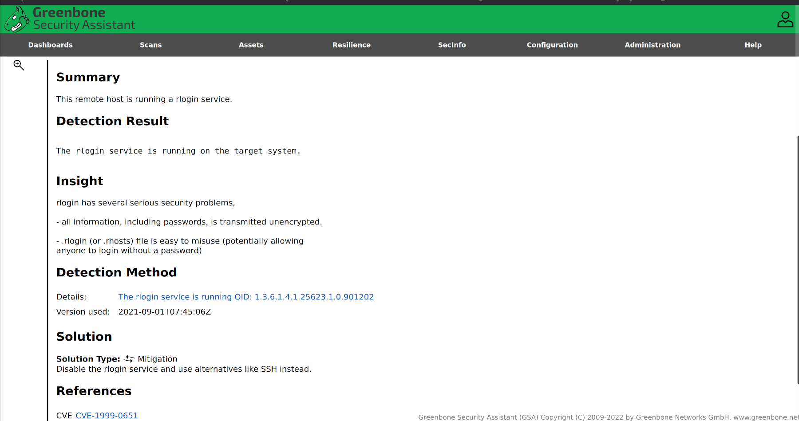

# Vulnerability scanning with Greenbone (OpenVAS)

## Attack tree

```text
1 Create a target
    1.1 Configuration -> Targets and click the new symbol
    1.2 Define the target and save
2 Create a task
    2.1 Select Scans -> Tasks and click the new symbol
    2.2 Define the task (task name and target name)
3 Run the task (click start symbol)
4 Results contains a list of all vulnerabilities detected
```

## Example



## Notes

### Warning

Do not do outside the lab without authorisation. Be aware of the following general side effects:

* Log and alert messages may show up on the target systems.
* Log and alert messages may show up on firewalls and intrusion detection and prevention systems. Intrusion prevention measures may be triggered.
* Scans may increase latency on the target and/or the scanned network, in extreme cases resulting in situations similar to a denial of service (DoS) attack.
* Scans may trigger bugs in fragile or insecure applications resulting in faults or crashes.
* Scans may result in user accounts being locked due to the testing of default username/password combinations.
* Logins (e.g., via SSH or FTP) are done against the target systems for banner grabbing purposes.
* Embedded systems and elements of operational technology with weak network stacks are especially subject to possible crashes or even broken devices.

## Defining hosts

For defining the host, we can use (and mix) the following options:

* Single IP address, e.g., 192.168.15.5
* Hostname, e.g., mail.example.com
* IPv4 address range in long format, e.g., 192.168.15.5-192.168.15.27
* IPv4 address range in short format, e.g., 192.168.55.5-27
* IPv4 address range in CIDR notation, e.g., 192.168.15.0/24 (at most 4096 IP addresses)
* Single IPv6 address, e.g., fe80::222:64ff:fe76:4cea
* IPv6 address range in long format, e.g., ::12:fe5:fb50-::12:fe6:100
* IPv6 address range in short format, e.g., ::13:fe5:fb50-fb80
* IPv6 address range in CIDR notation, e.g., fe80::222:64ff:fe76:4cea/120 (at most 4096 IP addresses)

## Tools

* [Greenbone](https://greenbone.github.io/docs/latest/index.html)
* [Greenbone getting started tutorials](https://www.greenbone.net/en/selflearning-courses/)